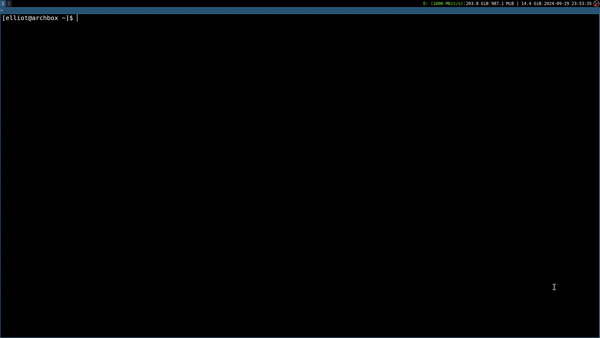

# yt-cli
Terminal-based Youtube player.  
</img>

## Dependencies

    MPV media player
    yt-dlp
    youtube-dl

## Installation

    git clone https://github.com/unwireddd/yt-cli
    cd yt-cli
    sudo chmod +x install.sh
    ./install.sh
